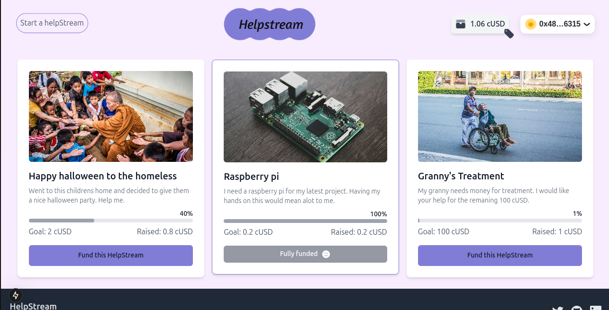
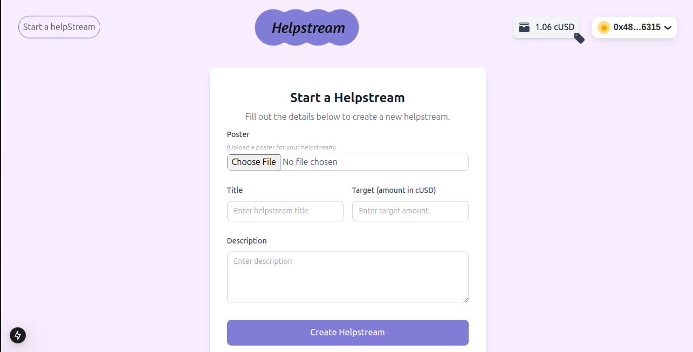
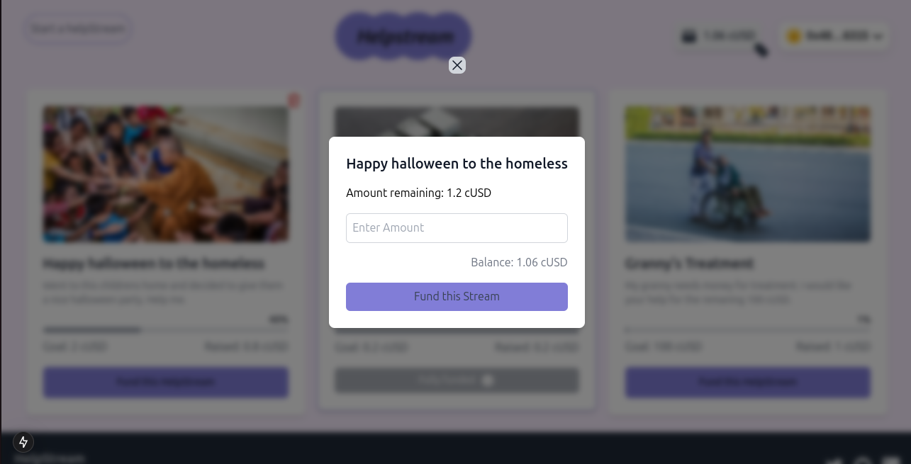

<!-- TITLE -->
<p align="center">
  

</p>

---

<div align="center"> <table> <tr> <td align="center">  </td> <td align="center">  </td> </tr> <tr> <td align="center">  </td>  </tr> </table> </div>

---

<details>
<summary> Table of Contents</summary>

- [About the Project](#about-the-project)
- [Installation and Setup](#setup-guide)
- [Demo](#demo)

</details>

## About the Project

**HelpStream** is a decentralized Web3 platform designed to empower individuals and organizations to create fundraising events or campaigns for personal, charitable, or community-driven causes.
Users can create or contribute to helpstreams, track progress in real-time, and ensure that funds are distributed fairly and without intermediaries.

### Objectives

- To offer a secure and transparent platform for raising and managing funds through blockchain technology.
- To facilitate the creation and contribution to various helpstreams, supporting individuals, charities, or community-driven projects.
- To ensure that donors can track their contributions and the progress of helpstreams in real-time.

### Scope

_Helpstream Creation:_ Users can create helpstreams with custom descriptions, funding goals, and project details. This feature is designed to cater to a wide range of use cases such as personal needs, charity campaigns, or community efforts.

_Contributions and Funding:_ Supporters can fund helpstreams directly using cUSD, ensuring that all transactions are securely recorded on the blockchain.

_Transparency and Security:_ The blockchain-backed architecture ensures all transactions are transparent, secure, and immutable. Donors can trace exactly where their contributions are going and the progress of each helpstream.

_Real-time Monitoring:_ Users and donors can view live updates on the funds raised, contributors, and overall progress towards the helpstream goal.

## Installation and Setup

### Prerequisites

To run the project locally;
Ensure you have **Node.js** installed.

### Steps

1. Clone the repository:
   ```bash
   git clone https://github.com/jeffIshmael/HelpStream
   cd HelpStream/packages/react-app
   ```
2. Install dependencies:

   ```bash
   npm install
   ```

3. Run the application:

   ```bash
   npm run dev
   ```

## Demo

Fund or create your helpstreams in our website [Live link](https://helpstream.vercel.app/)

## For more information, visit our [website](https://helpstream.vercel.app/) or contact support at [support@helpstream.com](mailto:jeffianmuchiri24@gmail.com).

<p align="right">(<a href="#top">back to top</a>)</p>
